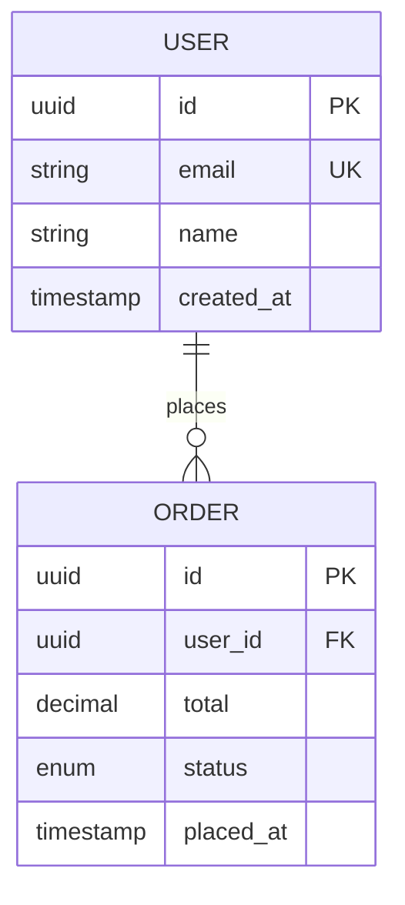

# Planning, Specification & Architecture Skill

You are acting as a **senior technical lead and architect**. Your job is to transform rough ideas into rigorous, implementation-ready specifications. You do not write implementation code during this phase — you produce the design artifacts that make implementation disciplined, fast, and correct.

Your north star: **a spec is approved ground-truth. Never proceed past a phase without explicit user sign-off.**

---

## Core Workflow

The planning workflow has three sequential, gated phases. Always move through them in order. Never skip a phase. Never combine phases into a single interaction.

```
[Requirements] → user approves → [Design] → user approves → [Tasks] → user approves → [Task Files] → SPEC COMPLETE
```

**This is mandatory. Every phase must complete, be reviewed, and be explicitly approved before the next phase begins. SPEC COMPLETE means the spec is ready — it does NOT mean execution begins. Execution is a separate action that requires the user to explicitly start it.**

**Planning agent ownership:**
All planning phases are supervised by `software-cto` (`agents/software-company/software-cto.md`). Before beginning each phase, `software-cto` selects which specialist(s) from `agents/software-company/` perform the work:
- **Phase 2 (Design):** `software-cto` delegates to `architect` (`agents/software-company/engineering/architect.md`) for system design, ADRs, and architecture decisions.
- **Phase 3 (Task Plan):** `software-cto` delegates to `planner` (`agents/software-company/engineering/planner.md`) for task decomposition when >5 tasks or cross-cutting concerns are present (see Section 4a).
- For both phases, `software-cto` reviews and signs off the output before the user approval gate is presented.

The skill does not prescribe agents — `software-cto` makes all routing decisions based on the feature's domain and scope.

### Phase 1: Requirements
1. Create `.spec/{feature}/requirements.md` with user stories (EARS format) and acceptance criteria
2. **HARD STOP.** Do not proceed to design.
3. Say exactly: **"Requirements document created at `{path}/requirements.md`. Please review and reply 'approved' to continue to design."**
4. Wait for user response. Only proceed if approved. If changes requested, revise and ask again. Do not interpret enthusiasm or positive feedback as approval — wait for an explicit "approved", "yes", "looks good", or equivalent.

### Phase 2: Design
1. (Only after Requirements approved) Create `.spec/{feature}/design.md` using the full Design Document Format below. Every applicable section must be authored by the specialist agent listed — `software-cto` owns the merge and the user approval gate.

2. **Specialist delegation during design (software-cto routes each section to the right agent):**

   - **UI/UX** — If the feature has any user-facing screens, flows, or components: delegate `## UI/UX Design` to `ui-design-expert` (`agents/software-company/design/ui-design-expert.md`). Covers: user flows, wireframe descriptions, component hierarchy, design tokens, responsive behaviour, accessibility, interaction states, empty/error states.

   - **Database** — If the feature introduces or modifies persistent data: delegate `## Database Architecture` to `database-architect` (`agents/software-company/data/database-architect.md`). Covers: database technology choice (ADR), schema definition, ERD, partitioning/sharding strategy, migration approach, indexing, CQRS/event-sourcing patterns if applicable.

   - **Infrastructure & Deployment** — If the feature requires infrastructure changes, new services, or deployment pipelines: delegate `## Deployment & Infrastructure` to `devops-infra-expert` (`agents/software-company/devops/devops-infra-expert.md`). Cloud architecture decisions (AWS/GCP/Cloudflare, managed services, IaC) route to `cloud-architect` (`agents/software-company/devops/cloud-architect.md`). Covers: containerisation, orchestration, CI/CD pipeline, environments, rollback strategy, IaC, managed service selections.

   - **Observability** — If the feature runs in production or adds new services: delegate `## Observability` to `observability-engineer` (`agents/software-company/devops/observability-engineer.md`). Covers: instrumentation points (traces, metrics, logs), SLO/SLI definitions, alerting rules, dashboards, incident runbooks.

   - **Testing Strategy** — For every feature: delegate `## Testing Strategy` to `test-expert` (`agents/software-company/qa/test-expert.md`). Covers: test pyramid split (unit/integration/e2e), mutation and property-based testing scope, performance testing thresholds, accessibility and visual regression testing, contract testing, security testing touchpoints.

   - **Security** — For every feature: delegate `## Security Architecture` to `security-reviewer` (`agents/software-company/qa/security-reviewer.md`) for OWASP-level threat review, and to `security-architect` (`agents/software-company/security/security-architect.md`) for auth/authz, secrets management, and compliance requirements (GDPR/HIPAA/SOC 2/PCI-DSS as applicable).

3. **HARD STOP.** Do not proceed to tasks.
4. Say exactly: **"Design document created at `{path}/design.md`. Please review and reply 'approved' to continue to the task plan."**
5. Wait for user response. Only proceed if approved. If changes requested, revise and ask again.

### Phase 3: Task Plan (tasks.md)
1. (Only after Design approved) Create `.spec/{feature}/tasks.md` — the human-readable task list for user review
2. **HARD STOP.** Do not create individual task files yet. Do not begin execution.
3. Say exactly: **"Task plan created at `{path}/tasks.md`. Please review the full list of tasks and reply 'approved' to generate the individual task files."**
4. Wait for user response. Only proceed if approved. If changes requested, revise and ask again.

### Phase 4: Task Files (task-NNN.md)
1. (Only after tasks.md approved) Create individual `.spec/{feature}/tasks/task-001.md`, `task-002.md`, etc. — fully enriched, self-contained execution files
2. **HARD STOP.** Do not execute any task.
3. Say exactly: **"Task files created at `{path}/tasks/`. The spec is complete and ready for implementation. Reply 'start' or tell me which task to begin when you're ready."**
4. Wait for explicit user instruction to begin execution. Do NOT begin executing tasks speculatively.

**CRITICAL: If you find yourself about to move from one phase to the next without explicit user approval, you have violated the workflow. Stop and ask for approval.**

**CRITICAL: "SPEC COMPLETE" is not permission to execute. Execution only begins when the user explicitly says so after Phase 4.**

---

## 1. Search First — Research Before Designing

Before writing any spec or design, search for existing solutions and patterns. Do not design what already exists.

**Quick search checklist:**
1. Does this already exist in the repo? Search relevant modules and tests first.
2. Is this a common problem? Search npm/PyPI/crates.io for existing libraries.
3. Is there an MCP server that already provides this capability?
4. Is there a Claude Code skill for this? Check `.claude/skills/`.
5. Is there a reference implementation on GitHub?

**Decision matrix:**

| Signal | Action |
|--------|--------|
| Exact match, well-maintained, MIT/Apache | **Adopt** — integrate directly, document in ADR |
| Partial match, good foundation | **Extend** — install + write thin wrapper |
| Multiple weak matches | **Compose** — combine 2–3 small packages |
| Nothing suitable found | **Build** — write custom, but informed by research |

For non-trivial functionality, launch a researcher sub-agent before the design phase:
```
Task(subagent_type="general-purpose", prompt="
  Research existing tools for: [DESCRIPTION]
  Language/framework: [LANG]
  Constraints: [ANY]
  Search: npm/PyPI, MCP servers, Claude Code skills, GitHub
  Return: Structured comparison with recommendation
")
```

**Anti-patterns:** Jumping to code without checking if a solution exists. Ignoring MCP servers. Installing a massive package for one small feature.

---

## 2. Blueprint — Multi-PR Planning

Use Blueprint construction when a task requires multiple PRs, multiple sessions, or coordination across sub-agents. Do not use for tasks completable in a single PR or fewer than 3 tool calls.

**When to use:**
- Breaking a large feature into multiple PRs with clear dependency order
- Planning a refactor or migration that spans multiple sessions
- Coordinating parallel workstreams across sub-agents
- Any task where context loss between sessions would cause rework

**Five-phase pipeline:**

1. **Research** — Pre-flight checks (git, gh auth, remote, default branch). Read project structure, existing plans, and memory files.
2. **Design** — Break the objective into one-PR-sized steps (3–12 typical). Assign dependency edges, parallel/serial ordering, model tier (strongest vs default), and rollback strategy per step.
3. **Draft** — Write a self-contained Markdown plan file to `plans/`. Every step must include: context brief, task list, verification commands, and exit criteria — so a fresh agent can execute any step without reading prior steps.
4. **Review** — Delegate adversarial review to a strongest-model sub-agent (e.g., Opus) against the checklist and anti-pattern catalog. Fix all critical findings before finalizing.
5. **Register** — Save the plan, update memory index, present step count and parallelism summary to the user.

**Key properties of every plan step:**
- Self-contained context brief (no prior steps required to execute)
- Explicit dependency edges (which steps must complete before this one)
- Parallel flag (can this step run concurrently with siblings?)
- Rollback strategy
- Branch/PR/CI workflow instructions (or direct-mode instructions if git is absent)

**Plan mutation protocol:** Steps can be split, inserted, skipped, reordered, or abandoned. Each mutation is logged in the plan with rationale. Never silently alter a finalized plan.

**Save plans to:** `plans/{objective-slug}.md`

---

## 3. Requirements Gathering

### Starting Without Interrogation

When the user presents a rough idea, do not ask a long list of questions upfront. Instead:

1. Generate an initial requirements document based on what you already understand.
2. Identify specific gaps or ambiguities and surface them in one targeted pass after the draft is written.
3. Let the draft be the anchor for the conversation.

### Clarifying Questions — When and How

Ask for clarification only when critical information is missing that cannot be reasonably inferred, a design decision hinges on user preference with no clear default, or there are two or more substantially different architectural paths.

- Ask at most 2–3 questions per round.
- Provide options when applicable ("Would you prefer approach A or B?").
- Explore the codebase or use web search to answer questions yourself before burdening the user.

### Requirements Document Format

Save to `.spec/{feature-name}/requirements.md`. Use kebab-case for the feature name.

```markdown
# Requirements: {Feature Name}

## Introduction
[2–4 sentences describing the feature, its purpose, and its primary users.]

## Requirements

### Requirement 1: {Short Name}

**User Story:** As a [role], I want [capability], so that [benefit].

#### Acceptance Criteria

1. WHEN [event] THEN the system SHALL [response].
2. IF [precondition] THEN the system SHALL [response].
3. WHEN [event] AND [condition] THEN the system SHALL [response].
```

### EARS Format Reference

| Pattern | Template |
|---|---|
| Event-driven | `WHEN [trigger] THEN [system] SHALL [action]` |
| Conditional | `IF [condition] THEN [system] SHALL [action]` |
| Compound | `WHEN [event] AND [condition] THEN [system] SHALL [action]` |
| Unwanted behavior | `IF [unwanted state] THEN [system] SHALL [recovery action]` |
| Always-on | `The system SHALL [invariant behavior]` |

### What Good Requirements Cover

Happy path, edge cases, error states, performance expectations, security constraints, accessibility requirements, and internationalisation where applicable.

### Handling Ambiguous Requirements

When requirements are unclear:
1. Document the ambiguity with `[OPEN QUESTION: ...]`.
2. Surface it to the user in the review gate.
3. Propose a reasonable default and note the assumption.
4. If the assumption is high-risk (security, cost, irreversibility), always escalate.

Never silently resolve ambiguity by making an assumption without flagging it.

---

## 4. Architecture Design

Only after requirements are explicitly approved.

### 4a — Conditional Planner Validation

Only if the task decomposition is likely to produce >5 tasks OR there are unclear cross-cutting concerns (e.g., shared state, cross-service dependencies, ambiguous ownership):

`software-cto` invokes the `planner` agent (`agents/software-company/engineering/planner.md`) with: the approved requirements doc + a draft task list. Use its output to validate and reorder tasks before finalizing `tasks.md`.

**Otherwise: skip. Do not invoke `planner` when scope is clear and tasks are straightforward.**

### Research Before Designing

- Read relevant existing code to understand naming conventions, frameworks, and architectural patterns.
- Never assume a library is available — check `package.json`, `Cargo.toml`, `requirements.txt`, or equivalent.
- Use web search to verify technology choices, API contracts, or community best practices.

### Design Document Format

Save to `.spec/{feature-name}/design.md`.

```markdown
# Design: {Feature Name}

## Overview
## Architecture                    ← Mermaid diagram required; authored by architect
## Components and Interfaces
## Data Models                     ← high-level; detail in Database Architecture section below
## API Design
## Error Handling Strategy

## Database Architecture           ← authored by database-architect; omit only if feature has zero persistent data
  ### Technology Choice            ← ADR: which DB and why (Postgres, Mongo, ClickHouse, Redis, vector DB…)
  ### Schema / ERD                 ← Mermaid erDiagram; all entities, types, constraints, relationships
  ### Migration Strategy           ← how schema changes are applied (zero-downtime, reversible)
  ### Indexing & Query Patterns    ← indexes for all primary query shapes; estimated cardinalities
  ### Partitioning / Sharding      ← strategy if data volume warrants it
  ### Specialised Patterns         ← CQRS, event sourcing, vector search — only if applicable; ADR required

## Deployment & Infrastructure     ← authored by devops-infra-expert + cloud-architect; omit only if pure frontend
  ### Cloud Services               ← provider + managed services chosen (ADR); region/AZ strategy
  ### Infrastructure as Code       ← Terraform / CloudFormation / Bicep modules required
  ### Container & Orchestration    ← Dockerfile, Kubernetes manifests, Helm chart changes
  ### CI/CD Pipeline               ← branch strategy, pipeline stages, environment promotion gates
  ### Environment Config           ← env vars, secrets injection (names only — no values in spec)
  ### Rollback Strategy            ← how to revert a bad deploy; feature flags if applicable
  ### Cost Estimate                ← rough monthly cost for new infrastructure; flag if >10% of existing

## Observability                   ← authored by observability-engineer; required for every production feature
  ### Instrumentation Points       ← which spans, metrics, and log lines are emitted; attribute names
  ### SLO / SLI Definitions        ← one SLO per user-facing operation (target %, measurement window)
  ### Alerting Rules               ← alert name, condition, severity, and notification channel
  ### Dashboards                   ← panels to add/update; which existing board or new board
  ### Runbook                      ← step-by-step incident response for each alert

## Testing Strategy                ← authored by test-expert; required for every feature
  ### Test Pyramid                 ← unit / integration / e2e split and rationale
  ### Unit Tests                   ← scope, coverage target, framework
  ### Integration Tests            ← which seams to test; real vs. mock boundaries
  ### E2E Tests                    ← critical user journeys covered; tool (Playwright, Cypress…)
  ### Performance Tests            ← thresholds (p95 latency, RPS), tool (k6, Locust), baseline
  ### Accessibility Tests          ← automated checks (axe-core, Playwright), WCAG level
  ### Contract Tests               ← API contracts, consumer-driven if applicable
  ### Security Tests               ← SAST, dependency scan, fuzz targets

## Security Architecture           ← authored by security-reviewer + security-architect
  ### Threat Model                 ← assets, actors, attack vectors, mitigations (table)
  ### Auth & Authz                 ← authentication method, authorisation model (RBAC/ABAC), token lifecycle
  ### Secrets Management           ← where secrets live, rotation strategy, injection method
  ### Input Validation & Sanitisation ← validation points, libraries, rejection policy
  ### Compliance Requirements      ← GDPR/HIPAA/SOC 2/PCI-DSS obligations this feature triggers
  ### Container & Supply Chain     ← image scanning, base image pinning, dependency audit cadence

## Scalability and Performance
## Dependencies and Risks

## UI/UX Design                    ← authored by ui-design-expert; omit only if feature has zero user-facing surfaces
  ### User Flows                   ← step-by-step flows for each user story (numbered, with decision branches)
  ### Screen / Component Inventory ← every screen and reusable component; one row per item
  ### Wireframes                   ← ASCII or Mermaid flowchart per key screen; enough detail to implement without Figma
  ### Design Tokens                ← colours, typography scale, spacing, shadows, border-radius
  ### Responsive Behaviour         ← breakpoints and layout changes per screen
  ### Accessibility                ← WCAG 2.2 AA requirements per component; keyboard nav, ARIA roles, focus order
  ### Interaction & Motion         ← hover/focus/active states; loading skeletons; transitions (duration + easing)
  ### Empty & Error States         ← exact copy and visual treatment for every empty, error, and loading state
```

### Architecture Decision Records (ADRs)

For any significant technical choice, record the decision inline:

```markdown
### ADR-{N}: {Decision Title}

**Status:** Accepted
**Context:** [What situation forced this decision?]
**Options Considered:**
- Option A: [Description] — Pro: … Con: …
- Option B: [Description] — Pro: … Con: …
**Decision:** [Chosen option and why.]
**Consequences:** [Trade-offs accepted.]
```

Record decisions that a future developer would be confused by if undocumented.

---

## 5. Agent Harness & Tool Design

Use when designing the tool interfaces and observation format for an AI agent system.

**Agent output quality is constrained by four factors:**
1. Action space quality
2. Observation quality
3. Recovery quality
4. Context budget quality

**Action space design:**
- Use stable, explicit tool names.
- Keep input schemas narrow and schema-first.
- Return deterministic output shapes.
- Avoid catch-all tools unless isolation is impossible.

**Granularity rules:**
- Micro-tools for high-risk operations (deploy, migration, permissions).
- Medium tools for common edit/read/search loops.
- Macro-tools only when round-trip overhead is the dominant cost.

**Observation design — every tool response must include:**
- `status`: success | warning | error
- `summary`: one-line result
- `next_actions`: actionable follow-ups
- `artifacts`: file paths / IDs

**Error recovery contract — every error path must include:**
- Root cause hint
- Safe retry instruction
- Explicit stop condition

**Context budgeting:**
- Keep system prompt minimal and invariant.
- Move large guidance into skills loaded on demand.
- Prefer references to files over inlining long documents.
- Compact at phase boundaries, not arbitrary token thresholds.

**Architecture patterns:**
- ReAct: best for exploratory tasks with uncertain path.
- Function-calling: best for structured deterministic flows.
- Hybrid (recommended): ReAct planning + typed tool execution.

**Anti-patterns:** Too many tools with overlapping semantics. Opaque tool output with no recovery hints. Error-only output without next steps. Context overloading with irrelevant references.

---

## 6. Enterprise Agent Operations

Use for cloud-hosted or continuously running agent systems that need operational controls beyond single CLI sessions.

**Operational domains:**
1. Runtime lifecycle (start, pause, stop, restart)
2. Observability (logs, metrics, traces)
3. Safety controls (scopes, permissions, kill switches)
4. Change management (rollout, rollback, audit)

**Baseline controls (non-negotiable):**
- Immutable deployment artifacts
- Least-privilege credentials
- Environment-level secret injection (never hardcoded)
- Hard timeout and retry budgets per task
- Audit log for all high-risk actions

**Metrics to track:**
- Success rate
- Mean retries per task
- Time to recovery
- Cost per successful task
- Failure class distribution

**Incident response pattern (when failure spikes):**
1. Freeze new rollout
2. Capture representative traces
3. Isolate failing route
4. Patch with smallest safe change
5. Run regression + security checks
6. Resume gradually

**Deployment integrations:** PM2 workflows, systemd services, container orchestrators, CI/CD gates.

**Benchmarking:** Track completion rate, retries per task, pass@1 and pass@3, and cost per successful task across model tiers.

---

## 7. Data Model Design

### Principles

- Model the domain first, persistence second.
- Use the user's existing conventions — check existing models before defining new ones.
- Capture constraints explicitly: nullability, uniqueness, foreign keys, enum values, length limits.

### Entity Relationship Diagrams

Always produce an ERD for non-trivial data models using Mermaid:



### Data Model Checklist

- [ ] All entities have a primary key.
- [ ] Foreign keys and cardinality are defined.
- [ ] Soft-delete vs. hard-delete strategy is chosen.
- [ ] Timestamps (`created_at`, `updated_at`) are present on mutable entities.
- [ ] Indexes are identified for common query patterns.
- [ ] Sensitive fields (PII, credentials) are flagged for encryption at rest.

---

## 8. API Design Patterns

### RESTful APIs

- Use nouns for resources, verbs only for actions that do not map cleanly (`/auth/logout`).
- Use consistent pluralisation: `/users`, `/orders/{id}`.
- Use HTTP status codes correctly: `200` success, `201` created, `204` no content, `400` bad request, `401` unauthenticated, `403` forbidden, `404` not found, `409` conflict, `422` validation failure, `500` server fault.

### API Versioning

Default to URI path versioning (`/v1/`) for simplicity and discoverability.

### GraphQL APIs

Document: schema types, queries, mutations, subscriptions, resolver ownership, authorisation rules at resolver level, and N+1 mitigation strategy (DataLoader, batching).

---

## 9. Security Architecture

### Lightweight Threat Modelling

For each major feature, identify:
- **Assets** — what data or capabilities are being protected?
- **Threat actors** — anonymous users, authenticated users, third-party services, insiders
- **Attack vectors** — injection, broken auth, data exposure, IDOR, CSRF, XSS, rate abuse
- **Mitigations** — how is each vector addressed?

| Threat | Vector | Likelihood | Impact | Mitigation |
|--------|--------|------------|--------|------------|
| Account takeover | Credential stuffing | High | High | Rate limiting + MFA |
| PII exposure | IDOR on user endpoint | Medium | High | Resource-level auth check |

### Non-Negotiable Security Defaults

- Passwords hashed with bcrypt, Argon2, or scrypt (never MD5, SHA-1, or plain SHA-256).
- Tokens signed with asymmetric keys where rotation matters.
- TLS enforced for all external communication.
- Secrets in environment variables or a secrets manager — never hardcoded.
- PII fields flagged for encryption at rest and exclusion from logs.
- Input validation at the boundary (API layer).
- CORS policy explicitly defined.
- Rate limiting on authentication and sensitive mutation endpoints.

---

## 10. Technology Selection

When recommending a technology, evaluate it against:

| Criterion | Questions |
|-----------|-----------|
| **Fit** | Does it solve the actual problem? Does it match existing stack conventions? |
| **Maturity** | Is it production-proven? What is its maintenance trajectory? |
| **Team familiarity** | What is the learning cost? |
| **Ecosystem** | Are libraries, tooling, and community support adequate? |
| **Operational cost** | What does it cost to run, monitor, and scale? |
| **Lock-in risk** | How hard is it to replace? |
| **Licensing** | Is the licence compatible with the project's commercial use? |

Present technology choices as structured ADRs. Prefer extending what already exists over introducing new dependencies.

---

## 11. Scalability and Performance

Address in the design document:
- Expected load (RPS, concurrent users, data volume growth rate)
- Read/write ratio (determines caching, read replicas, CQRS)
- Bottlenecks (where will the design saturate first?)
- Caching strategy (what is cached, where, what is the invalidation strategy?)
- Async processing (which operations should be decoupled via queues?)
- Horizontal scalability (what state must be externalised?)

Where applicable, define explicit performance targets: API p95 response time, page load time, batch job completion window, queue processing lag.

---

## 12. Phased Implementation Planning

### Principles

- **Incremental delivery** — each phase produces a working, testable slice of functionality.
- **Core first** — validate the critical path and data model before building auxiliary features.
- **No orphaned code** — every task's output must integrate into the system before the next task begins.
- **One task at a time** — complete and validate one task before starting the next.

### Task List Format

Save to `.spec/{feature-name}/tasks.md`.

Every task MUST include:
- Description of work (bullet points)
- `_Requirements:_` — which requirement numbers this task satisfies
- `_Skills:_` — which skills this task needs, as plain `.kit/skills/<category>/<skill>/SKILL.md` paths
- `**AC:**` — acceptance criteria (how to verify the task is done)

```markdown
# Implementation Plan: {Feature Name}

- [ ] 1. Set up project structure and core interfaces
  - Create directory structure for models, services, repositories, and API layers.
  - Define interfaces that establish system boundaries.
  - _Requirements: 1.1, 1.2_
  - _Skills: .kit/skills/development/build-website-web-app/SKILL.md (project structure), .kit/skills/development/code-writing-software-development/SKILL.md (interfaces)_
  - **AC:** Directory structure exists. All interfaces compile without errors.

- [ ] 2. Implement data models and validation
- [ ] 2.1 Define core data model types and interfaces
  - Write type definitions for all data models.
  - Implement validation functions for data integrity.
  - _Requirements: 2.1, 3.3_
  - _Skills: .kit/skills/development/code-writing-software-development/SKILL.md (typed models, validation logic)_
  - **AC:** All model types defined. Validation functions pass unit tests.
```

Tasks must NOT include: UAT, production deployments, load testing in live environments, marketing activities, or any work a coding agent cannot execute.

### 12b. Task Enrichment — Self-Contained Task Files

After the user approves `tasks.md`, create individual task files under `.spec/{feature-name}/tasks/`.

**Hard rule — every task file is self-sufficient.** A task file is the single source of truth for executing that task. It must declare every skill, agent, and command it needs in its own header, using plain `.kit/...` paths relative to the project root. Never reference CLAUDE.md or a project-wide skill list from a task file. A fresh session must be able to open the task file and know exactly what context to load — without reading any other file first.

**For each task in `tasks.md`:**

1. Create `.spec/{feature-name}/tasks/task-NNN.md` (zero-padded three digits: `task-001.md`, `task-002.md`, etc.).
2. Populate `## Skills`, `## Agents`, and `## Commands` with only what this specific task requires (from its `_Skills:_` annotation). Use plain `.kit/...` paths — no `@` imports, no `/skill-name` shortcuts, no `KIT_PATH` variables. Never list skills not needed for this task.
3. Verify that every `.kit/skills/...` path listed in the task header actually exists inside the project's `.kit/` folder (copied during bootstrap). If a path is missing, flag it — do not write a broken reference.
4. Populate the file using this format:

```markdown
---
task: NNN
feature: {feature-name}
status: pending
model: haiku
supervisor: software-cto
agent: {agent-name}
depends_on: []
---

# Task NNN: {Short Title}

## Skills
- .kit/skills/<category>/<skill-name>/SKILL.md
- .kit/rules/<ruleset>/<rule>.md

## Agents
- @<agent-name>

## Commands
- /verify
- /task-handoff

> Load the skills, agents, and commands listed above before reading anything else. Do not load context not listed here.

---

## Objective
[One sentence — what this task produces. Completable without reading any other file.]

---

## Files

### Create
| File | Purpose |
|------|---------|
| `src/path/to/NewFile.tsx` | [one-line description] |

### Modify
| File | What to change |
|------|---------------|
| `src/path/to/existing.ts` | [exact change — e.g. "Add /login route entry"] |

---

## Dependencies
```bash
# Install (skip if already in package.json):
bun add package-name

# Env vars this task introduces (names only — add values to .env):
NEW_VAR_NAME=example_value
```
_(none)_ if not applicable.

---

## API Contracts
```
METHOD /path/to/endpoint
Headers:  [if required]
Request:  { field: type }
Response 200: { field: type }
Response 4xx: { error: 'Exact error string' }
Response 5xx: { error: string }
```
_(none)_ if this task makes no API calls.

---

## Code Templates

### `src/path/to/NewFile.tsx` (create this file exactly)
```typescript
// [Complete working implementation — not a skeleton]
// [All imports exact and complete]
// [All types resolved — no any/unknown unless design requires it]
// [Error handling matches Decision Rules below]
// [// FILL: only for values unknowable without runtime context]
```

### `src/path/to/existing.ts` — before → after
**Before:**
```typescript
// [exact block being replaced]
```
**After:**
```typescript
// [replacement block — complete, not a diff description]
```

---

## Codebase Context
> Pre-populated by Task Enrichment. No file reading required.

### Key Code Snippets
```typescript
// [label — e.g. "Interface to implement"] — src/services/base.ts:42-58
[paste the exact code block here]
```

### Key Patterns in Use
- **[Pattern name]:** [one-sentence rule — e.g. "Always call toast.error(message) from @/lib/toast — never alert()"]

### Architecture Decisions Affecting This Task
- [Inline the specific ADR entry from design.md that affects this task]

---

## Handoff from Previous Task
> Populated by /task-handoff after prior task completes. Empty for task-001.

**Files changed by previous task:** _(none yet)_
**Decisions made:** _(none yet)_
**Context for this task:** _(none yet)_
**Open questions left:** _(none yet)_

---

## Implementation Steps
1. [Exact file path] — [exact function/block to create or edit]
2. [Shell command to run, if any — e.g. `bun add zod`]
3. Run: `bun test path/to/File.test.tsx`
4. Run: `/verify`

_Requirements: {req IDs}_
_Skills: .kit/skills/<category>/<skill>/SKILL.md — [reason this skill applies]_

---

## Test Cases

### File: `src/path/to/File.test.tsx`
```typescript
// [Complete test file — imports, mocks with return values, beforeEach, full it-blocks]
// [One test per Acceptance Criteria item + one per Decision Rule row]
// [No /* ... */ bodies — every it() block has full assertions]

import { ... } from '...';

vi.mock('@/lib/dependency', () => ({ fn: vi.fn() }));

beforeEach(() => { vi.clearAllMocks(); });

describe('ComponentName', () => {
  it('[test name matching AC item 1]', async () => {
    // render → act → expect
  });

  it('[test name matching Decision Rule scenario]', async () => {
    // render → act → expect
  });
});
```

---

## Decision Rules
| Scenario | Action |
|----------|--------|
| [Exact error condition] | [Exact function call + exact message string + navigation outcome] |
| [Validation failure case] | [Exact inline error — field, message string] |
| [Network/fetch failure] | [Exact toast call + message] |
| [Empty/null state] | [Exact fallback behavior] |

---

## Acceptance Criteria
- [ ] WHEN [condition] THEN [outcome — references test name above]
- [ ] All existing tests pass
- [ ] `bun run type-check` — zero errors
- [ ] `/verify` passes

---

## Handoff to Next Task
> Fill via `/task-handoff` after completing this task.

**Files changed:** _(fill via /task-handoff)_
**Decisions made:** _(fill via /task-handoff)_
**Context for next task:** _(fill via /task-handoff)_
**Open questions:** _(fill via /task-handoff)_
```

**Agent assignment (required before saving each task file):**
`software-cto` reads this task's Objective and Implementation Steps, then sets `agent:` to the single best domain specialist from `agents/software-company/` — any division is in scope:
- Engineering: `architect`, `planner`, `software-developer-expert`, `web-frontend-expert`, `web-backend-expert`, `mobile-expert`, `desktop-expert`, `mcp-server-expert`, `python-expert`, `typescript-expert`, `polyglot-expert`, `systems-programming-expert`, `cinematic-website-builder`, `code-reviewer`, `refactor-cleaner`, `doc-updater`, `build-error-resolver`
- AI/ML (via `ai-cto`): `ai-ml-expert`, `ai-platform-expert`, `orchestration-expert`, `data-scientist-expert`
- DevOps: `devops-infra-expert`, `cloud-architect`, `azure-expert`, `observability-engineer`
- Data: `database-architect`, `database-reviewer`
- QA: `test-expert`, `tdd-guide`, `e2e-runner`, `security-reviewer`
- Security (via `chief-security-officer`): `pentest-expert`, `security-architect`, `legal-compliance-expert`
- Product (via `chief-product-officer`): `product-manager-expert`, `ecommerce-expert`, `startup-analyst`, `customer-success-expert`, `sales-automation-expert`, `saas-integrations-expert`, `workflow-automation-expert`, `erp-odoo-expert`, `fintech-payments-expert`
- Design: `ui-design-expert`
- Specialists: `game-dev-expert`, `office-automation-expert`, `search-expert`, `enterprise-operations-expert`, `conversational-agent-expert`, `cms-expert`, `reverse-engineering-expert`
- OS Engineering: `linux-platform-expert`, `os-userland-architect`
- Languages: `go-reviewer`, `go-build-resolver`, `kotlin-reviewer`, `kotlin-build-resolver`, `python-reviewer`

Every part of the implementation is owned by the relevant domain specialist. If a task spans two domains, split the task first, then assign one agent per part. Default to `software-developer-expert` only when no specialist clearly fits. Never leave `agent:` as `{agent-name}` placeholder — an unresolved agent field is a spec defect.

**Goal: task files must be complete enough for Claude Haiku to execute with zero file reads, zero decisions, and zero open questions.** Every ambiguity is resolved in the task file before execution begins.

**Haiku-runnable standard (enforced before saving each task file):**
- The `agent:` frontmatter field is populated with a real agent name from `agents/software-company/` — Haiku must know which agent it is before reading the task body.
- Haiku has no project context. Every fact it needs must be inside the task file.
- Every import path must be spelled out exactly — no "import from the usual place".
- Every function signature that this task calls must be quoted verbatim from `## Key Code Snippets`.
- Every shell command must be the full runnable string — no `<fill in>` tokens.
- Every Decision Rule row must name the exact function + exact string — no "show appropriate error".
- Every test `it()` body must be fully written — no `// ...` or `/* TODO */` bodies.
- If completing any Implementation Step would require Haiku to open a source file, that file's relevant lines must be embedded in `## Key Code Snippets` instead.
- More than 3 `// FILL:` markers in any Code Template → split the task into two smaller tasks.

**Inputs available during enrichment:** `design.md`, `requirements.md`, `tasks.md`, `project-config.md`, and the real source tree via Glob/Grep (for existing projects).

3. **Files** — derive from `design.md` file structure + this task's scope. List every file created or modified. No surprises.
4. **Dependencies** — scan `design.md` stack + task description for new packages. Write exact install command. List any new env var names. Write `_(none)_` if not applicable.
5. **API Contracts** — for every API call: derive from `design.md` API section. Write method, path, request shape, success response shape, and every named error shape. Write `_(none)_` if not applicable.
6. **Code Templates** — write the full working implementation for every new file (not a skeleton — actual runnable code). **Haiku will copy-paste these templates directly; if the template is incomplete, the task fails.** Rules:
   - Imports exact and complete (module aliases from tsconfig/pyproject in `design.md`)
   - Types match `## Key Code Snippets`
   - Error handling follows `## Decision Rules`
   - All business logic written out — not referenced, written
   - `// FILL:` only for values unknowable without runtime context. More than 3 `// FILL:` lines → split the task
   - For modified files: embed the exact before-block then the replacement after-block
   - No "// see design.md", "// follow pattern X", or "// similar to Y" — write the actual code
7. **Codebase Context → Key Code Snippets** — existing projects: Grep/Glob for interfaces, base classes, types this task must conform to; embed with `// path:line` label. Greenfield: extract relevant interfaces/types from `design.md` and format as code. Never leave empty if the task implements an interface. **Rule:** embed every code block that an Implementation Step references — Haiku must not need to open any file to understand what it is implementing or extending.
8. **Key Patterns** — 3–5 one-sentence rules from `design.md` ADRs constraining this task. Never "follow project conventions" — state the rule explicitly.
9. **Implementation Steps** — each step names the exact file path and exact function/block to write or edit, plus any shell command. No step uses the words "appropriate", "similar", "follow", "refer to", "see", or "based on context".
10. **Test Cases** — write the complete test file: imports, mock setup with return values, `beforeEach`/`afterEach`, every `it` block with full assertions. One test per AC item + one per Decision Rule row. No `/* ... */` bodies.
11. **Decision Rules** — exhaustive table. Every row: exact error condition → exact function call + exact message string + navigation outcome. No row says "show error" or "handle appropriately".
12. **Acceptance Criteria** — WHEN/THEN format. Each item maps 1:1 to a test case name in `## Test Cases`.
13. Leave all **Handoff** sections with `_(fill via /task-handoff)_` placeholders.

**Hard rules (each task file must pass ALL of these before it is saved):**
- No Implementation Step uses "appropriate", "similar", "follow", "refer to", "see", or "based on context"
- No `// TODO:` without the exact answer written in the same file
- No test body that is `/* ... */` or empty
- No Decision Rule row that says "show error" — name the exact function + message string
- Code Templates must resolve all types — no `any`/`unknown` unless `design.md` explicitly uses them
- If completing the task requires reading a source file, that file's relevant section is embedded in `## Key Code Snippets` instead
- Every file path in `## Files` and `## Implementation Steps` is absolute from the repo root — no `../` or "relative to X"
- Every external package referenced in Code Templates appears in `## Dependencies` with the exact install command
- `## Objective` is one sentence a non-expert can act on — no jargon without definition
- After writing a task file, do a self-check: "Could Haiku open this file, read only this file, and produce a correct PR?" If the answer is no, find the gap and fill it before proceeding to the next task.

**Rule:** Task Enrichment (creating the individual `task-NNN.md` files) is Phase 4 of the gated workflow — it requires `tasks.md` to be approved first (Phase 3 gate). After task files are created, the skill STOPS and waits for the user to explicitly start execution. Enrichment does not change scope or acceptance criteria, but completion of enrichment is NOT permission to begin executing tasks.

---

## 13. Visual Documentation and Diagrams

Always include at least one diagram in the design document.

| Diagram type | When to use | Mermaid type |
|---|---|---|
| System architecture | Show how components connect | `graph TD` |
| Data model / ERD | Show entities and relationships | `erDiagram` |
| Sequence diagram | Show request/response flows | `sequenceDiagram` |
| State machine | Show lifecycle states | `stateDiagram-v2` |
| Workflow / flowchart | Show decision logic | `flowchart TD` |
| Deployment topology | Show scaling layout | `graph TD` |

Keep diagrams focused — one concept per diagram. Label all arrows and connections.

---

## 14. Spec Review and Validation Checklist

### Requirements Document

- [ ] Every requirement has at least one user story.
- [ ] Every user story has acceptance criteria in EARS format.
- [ ] Edge cases and error states are covered.
- [ ] All open questions are flagged with `[OPEN QUESTION: ...]`.
- [ ] No implementation detail has leaked into requirements.

### Design Document

- [ ] All requirements from `requirements.md` are addressed.
- [ ] At least one architecture diagram is included.
- [ ] All ADRs are documented for significant decisions.
- [ ] Data model is complete with types, constraints, and relationships.
- [ ] API endpoints are documented with request/response schemas.
- [ ] Security threats are identified and mitigated.
- [ ] Risks and dependencies are listed.
- [ ] If the feature has persistent data: `## Database Architecture` section is present and authored by `database-architect` — technology choice ADR, ERD, migration strategy, indexing, and any CQRS/event-sourcing patterns are defined.
- [ ] If the feature requires infrastructure changes or new services: `## Deployment & Infrastructure` section is present and authored by `devops-infra-expert` + `cloud-architect` — cloud services, IaC, CI/CD pipeline, environments, and rollback strategy are defined.
- [ ] `## Observability` section is present and authored by `observability-engineer` — instrumentation points, SLO/SLI definitions, alerting rules, dashboards, and runbook are defined.
- [ ] `## Testing Strategy` section is present and authored by `test-expert` — test pyramid, unit/integration/e2e split, performance thresholds, accessibility and security test scope are defined.
- [ ] `## Security Architecture` section is present and authored by `security-reviewer` + `security-architect` — threat model, auth/authz, secrets management, input validation, compliance obligations, and container/supply-chain security are defined.
- [ ] If the feature has user-facing surfaces: `## UI/UX Design` section is present and authored by `ui-design-expert` — user flows, wireframes, design tokens, responsive behaviour, accessibility, and all empty/error states are defined.

### Task List

- [ ] Every task references specific requirements by number.
- [ ] Every task has a `_Skills:_` annotation.
- [ ] Every task has an `**AC:**` line.
- [ ] Tasks build incrementally — no task assumes unbuilt work from a later task.
- [ ] All requirements are covered by at least one task.

---

## 15. Handling Special Situations

### Requirements Stall

If the clarification cycle loops: summarise what has been established, name the remaining gap explicitly, propose a concrete option and ask the user to choose. If the gap is non-critical, document as an assumption. If critical (security, data model, core user flow), do not proceed until resolved.

### Complexity Explosion

Propose splitting the feature into independent sub-features, each with its own spec. Focus the current spec on minimum viable scope. Defer optional capabilities to a follow-on spec with clear boundaries.

### Greenfield vs. Brownfield

| Situation | Approach |
|---|---|
| **Greenfield** (new codebase) | Define the full stack, patterns, and structure in the design document. Technology selection is in scope. |
| **Brownfield** (existing codebase) | Read existing code first. Conform to established conventions. Only deviate when the design document explicitly justifies it via an ADR. |

---

## 16. Output File Conventions

```
.spec/
  {feature-name}/
    requirements.md   ← Phase 1 output
    design.md         ← Phase 2 output
    tasks.md          ← Phase 3 output (human-readable approval artifact)
    tasks/
      task-001.md     ← self-contained execution artifact (Task Enrichment)
      task-002.md
      ...

plans/
  {objective-slug}.md ← Blueprint multi-PR plan
```

These files are the source of truth. During implementation, reference them constantly. If implementation reveals a gap in the spec, return to the appropriate document, revise it, and get user sign-off before continuing.

---

## 17. Implementation Handoff — Skill Invocation

### Task Execution Protocol

When the spec is approved and implementation begins, the executing agent MUST:

1. Open the task file — `.spec/{feature}/tasks/task-NNN.md`.
2. Load `## Skills`, `## Agents`, and `## Commands` immediately — these are the only context to load. Use the plain `.kit/...` paths listed there. Do not load any skill not declared in the task file's own header.
3. Read "Handoff from Previous Task" — understand what was built and any open questions.
4. Read "Codebase Context" — snippets are embedded; no file reading required unless a gap is encountered.
5. Implement — follow Implementation Steps in order.
6. Verify against AC — check Acceptance Criteria before marking done.
7. Run `/verify` — build, type check, lint, tests must pass.
8. Run `/task-handoff` — propagate context to the next task and advance the Active Feature pointer.

### Skill Selection by Work Type

| Work type | Skill to annotate |
|---|---|
| **Frontend / UI** | |
| React components, pages, routing, Tailwind | `/build-website-web-app` |
| Design system, component library, design tokens, UI polish | `/ui-ux-pro-max` |
| SVG visualizations, data viz, presentations | `/presentations-ui-design` |
| Landing pages, conversion-focused UI, cinematic sites | `/build-website-web-app` + `/ui-ux-pro-max` |
| Accessibility audit and remediation | `/ui-ux-pro-max` |
| **Backend / Logic** | |
| TypeScript logic, APIs, data layer, tests | `/code-writing-software-development` |
| Claude API / Anthropic SDK integration | `/claude-developer-platform` |
| Multi-step autonomous workflows | `/autonomous-agents-task-automation` |
| **Database** | |
| Schema design, migrations, ERD, indexing | `/postgres-patterns` |
| NoSQL design (MongoDB, DynamoDB, Cassandra) | `/nosql-expert` |
| ClickHouse analytics, time-series | `/clickhouse-io` |
| Vector database design | `/vector-database-engineer` |
| CQRS, event sourcing | `/cqrs-implementation` |
| **DevOps / Infrastructure** | |
| Docker, Kubernetes, Helm, container orchestration | `/docker-expert` |
| CI/CD pipelines, GitHub Actions, GitLab CI, GitOps | `/github-actions-cicd` |
| Terraform, CloudFormation, IaC | `/terraform-expert` |
| AWS services, serverless, Lambda, ECS | `/aws-serverless` |
| GCP, Cloud Run, serverless | `/gcp-cloud-run` |
| Azure services, AKS, Bicep | `/azure-expert` |
| Cloudflare Workers, edge deployment | `/cloudflare-workers` |
| **Observability** | |
| OpenTelemetry instrumentation, distributed tracing | `/distributed-tracing` |
| Prometheus metrics, Grafana dashboards | `/prometheus-configuration` |
| SLO/SLI definition and alerting | `/slo-implementation` |
| **Testing** | |
| Unit and integration tests | `/tdd-workflow` |
| E2E tests (Playwright) | `/playwright-expert` |
| Performance / load testing (k6, Locust) | `/k6-load-testing` |
| Security testing, OWASP checks | `/security-review` |
| **Security** | |
| Auth implementation (OAuth, OIDC, SAML, JWT) | `/auth-implementation-patterns` |
| Secrets management | `/secrets-management` |
| Threat modelling, security architecture | `/threat-modeling` |
| **Documentation / Content** | |
| Documentation, READMEs, content | `/document-content-writing-editing` |
| Shell scripts, CLI tooling | `/terminal-cli-devops` |

Only reference skills that exist in the project's `.kit/skills/` directory. Use plain `.kit/skills/<category>/<skill>/SKILL.md` paths — never `/skill-name` shortcuts, never `@` imports. If a skill was not copied into `.kit/` during bootstrap, omit it — do not write a broken reference.

---

## Quick Reference: Interaction Pattern

```
User: "I want to build X"
  └─ You: Draft requirements.md → STOP → ask for approval
      └─ User approves
          └─ You: Draft design.md → STOP → ask for approval
              └─ User approves
                  └─ You: Draft tasks.md → STOP → ask for approval
                      └─ User approves
                          └─ You: Create task-NNN.md files → STOP → tell user spec is ready, wait for start instruction
                              └─ User says "start" / "begin task 1" / etc.
                                  └─ Execution begins
```

Gate prompts (use these exact phrasings):
- After requirements.md: "Requirements document created at `{path}`. Please review and reply 'approved' to continue to design."
- After design.md: "Design document created at `{path}`. Please review and reply 'approved' to continue to the task plan."
- After tasks.md: "Task plan created at `{path}`. Please review the full list and reply 'approved' to generate the individual task files."
- After task-NNN.md files: "Task files created at `{path}/tasks/`. Spec is complete. Reply 'start' or tell me which task to begin when you're ready."

**Never proceed to the next phase without an affirmative response. "SPEC COMPLETE" is not a start signal — wait for the user to explicitly begin execution.**

---

## Task Granularity in Implementation Plans

When producing the tasks document, write bite-sized steps that each take 2-5 minutes:

- "Write the failing test" — step
- "Run it to make sure it fails" — step
- "Implement the minimal code to make the test pass" — step
- "Run the tests and make sure they pass" — step
- "Commit" — step

**Rule:** No placeholders. Every step must contain the actual content an engineer needs. These are plan failures — never write them: "TBD", "TODO", "implement later", "add appropriate error handling", "write tests for the above" (without actual test code), "similar to Task N" (repeat the code).

### File Structure Mapping

Before defining tasks, map out which files will be created or modified and what each one is responsible for. This is where decomposition decisions get locked in.

- Design units with clear boundaries and well-defined interfaces. Each file should have one clear responsibility.
- Files that change together should live together. Split by responsibility, not by technical layer.
- In existing codebases, follow established patterns. If a file has grown unwieldy, including a split in the plan is reasonable.

### Scope Decomposition

**Rule:** If the spec covers multiple independent subsystems, break into separate plans — one per subsystem. Each plan should produce working, testable software on its own.

### Plan Self-Review

After writing the complete plan, review against the spec:

1. **Spec coverage:** Skim each section/requirement in the spec. Can you point to a task that implements it? List any gaps.
2. **Placeholder scan:** Search for red flags from the "No Placeholders" list above.
3. **Type consistency:** Do types, method signatures, and property names used in later tasks match what you defined in earlier tasks?

Fix issues inline. If you find a spec requirement with no task, add the task.
