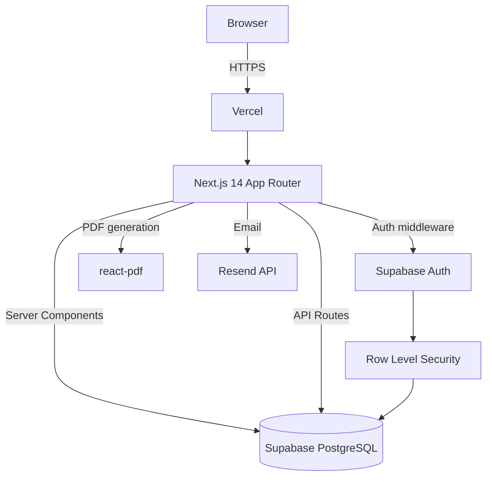
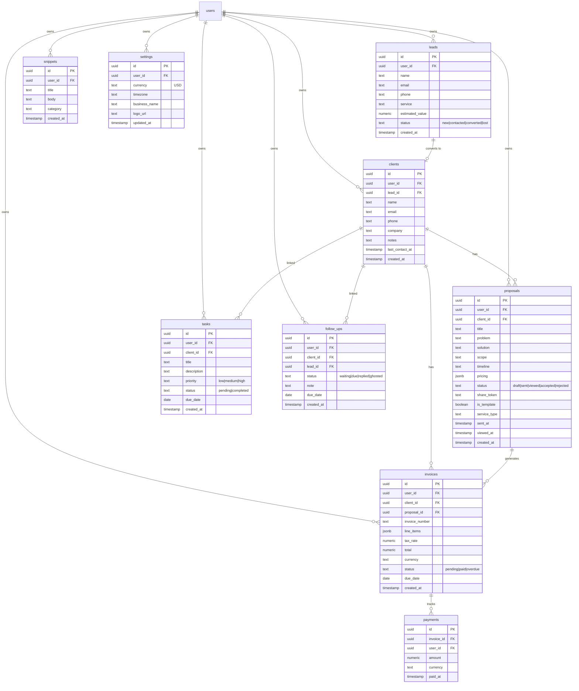

# MicroBiz Toolbox — Design

## Architecture

**Request flow:**
1. User hits a page → Next.js Server Component runs
2. Server Component queries Supabase directly (server-side client, no API round-trip)
3. Mutations go through Next.js API Route handlers (`/api/*`)
4. All DB access gated by RLS — users can only read/write their own rows
5. Client components handle UI state only; data fetching is server-side

---

## Data Models (ERD)

---

## API Design

All routes are under `/api/`. All require authenticated session (middleware validates Supabase JWT).

| Method | Route | Description |
|---|---|---|
| GET | `/api/leads` | List leads for current user |
| POST | `/api/leads` | Create lead + auto follow-up |
| PATCH | `/api/leads/:id` | Update lead |
| POST | `/api/leads/:id/convert` | Convert lead → client |
| GET | `/api/clients` | List clients |
| GET | `/api/clients/:id` | Client profile with relations |
| POST | `/api/clients` | Create client directly |
| PATCH | `/api/clients/:id` | Update client |
| GET | `/api/proposals` | List proposals |
| POST | `/api/proposals` | Create proposal + auto follow-up task |
| PATCH | `/api/proposals/:id` | Update proposal |
| POST | `/api/proposals/:id/send` | Mark sent, generate share token |
| POST | `/api/proposals/:id/accept` | Accept → create deal record |
| GET | `/api/proposals/view/:token` | Public proposal view (no auth) |
| GET | `/api/invoices` | List invoices |
| POST | `/api/invoices` | Create invoice + auto payment-check task |
| PATCH | `/api/invoices/:id` | Update invoice |
| POST | `/api/invoices/:id/pay` | Mark paid → record payment → update income |
| GET | `/api/follow-ups` | List follow-ups sorted by urgency |
| POST | `/api/follow-ups` | Create follow-up |
| PATCH | `/api/follow-ups/:id` | Update status |
| GET | `/api/tasks` | List tasks |
| POST | `/api/tasks` | Create task |
| PATCH | `/api/tasks/:id` | Update / complete task |
| GET | `/api/income` | Monthly income summary |
| GET | `/api/snippets` | List snippets |
| POST | `/api/snippets` | Create snippet |
| PATCH | `/api/snippets/:id` | Update snippet |
| GET | `/api/analytics` | Funnel + conversion metrics |
| GET | `/api/search?q=` | Search across clients, proposals, invoices |
| GET | `/api/settings` | Get user settings |
| PUT | `/api/settings` | Save user settings |
| GET | `/api/dashboard` | Aggregated dashboard data (single request) |

---

## ADRs (Architecture Decision Records)

### ADR-1: Server Components for data fetching
**Decision:** Use Next.js Server Components for all read operations; API routes only for mutations.
**Why:** Eliminates client-side fetch waterfalls, reduces JS bundle size, simpler auth (server-side Supabase client has direct DB access).

### ADR-2: Supabase RLS as the security boundary
**Decision:** All tables have RLS policies enforcing `user_id = auth.uid()`.
**Why:** Prevents data leakage even if API logic has bugs. Security is enforced at the DB layer, not just the application layer.

### ADR-3: jsonb for line_items and pricing
**Decision:** Store invoice line items and proposal pricing as `jsonb` rather than a separate table.
**Why:** Line items rarely need to be queried independently. jsonb avoids a join and keeps invoice creation in a single insert.

### ADR-4: share_token for public proposal links
**Decision:** Proposals have a `share_token` (random UUID) for public access via `/proposals/view/:token`.
**Why:** Clients should be able to view and accept proposals without creating an account. Token must be unguessable.

### ADR-5: Auto-task and auto-follow-up triggers in API layer
**Decision:** Auto-creation of follow-ups and tasks happens inside API route handlers, not DB triggers.
**Why:** Easier to test, easier to disable/configure, avoids hidden side effects in the database.

---

## Security Design

- **Auth:** Supabase Auth (JWT, httpOnly cookies via SSR helper)
- **RLS:** Every table has `USING (user_id = auth.uid())` policy
- **Public routes:** Only `/api/proposals/view/:token` is unauthenticated — read-only, no PII beyond proposal content
- **Input validation:** All API routes validate with Zod before DB write
- **CSRF:** Next.js API routes use SameSite cookies; no custom CSRF token needed
- **Secrets:** All keys in `.env`, never committed, never exposed to client bundle
- **Rate limiting:** Add Vercel Edge middleware rate limiting on auth routes (future)

---

## Performance Design

- **Dashboard API:** Single `/api/dashboard` endpoint returns all widget data in one DB query (avoid N+1 on page load)
- **Pagination:** All list endpoints support `?page=&limit=` (default limit: 50)
- **Search:** Postgres `ILIKE` with `pg_trgm` index on name/email/title columns
- **Images:** Supabase Storage for logo uploads; served via CDN
- **PDF generation:** Generated server-side on-demand, not pre-stored
- **Caching:** Next.js `revalidate` on server components for dashboard (30s); no stale data on mutations
